# 🐾 A Friend for Life - Plataforma de Adoção de Animais

Sistema web completo para conectar protetores de animais a pessoas interessadas em adoção, facilitando o encontro entre pets e seus futuros lares.

## 🚀 Acesso ao Sistema

### URL de Produção
**Acesse a aplicação em produção no seguinte link:**
### [https://um-amigo-for-life02.onrender.com/](https://um-amigo-for-life02.onrender.com/)

### Credenciais para Avaliação
Para facilitar a avaliação das funcionalidades que exigem autenticação, um usuário de teste foi pré-cadastrado no ambiente de produção.
*   **Email:** `usertest2156@gmail.com`
*   **Senha:** `User1234`


---

## 🎯 Problema Abordado e Objetivos

### Problema
O grande número de animais abandonados e a dificuldade de conexão entre protetores independentes/ONGs e potenciais adotantes criam um ciclo de superlotação em abrigos e sofrimento animal. Protetores lutam para dar visibilidade aos animais, enquanto pessoas que desejam adotar muitas vezes não sabem por onde começar a procurar.

### Objetivos do Sistema
*   **Centralizar e Facilitar a Adoção:** Criar um ponto de encontro digital, unificando os anúncios de pets para adoção e simplificando o processo de busca para os adotantes.
*   **Aumentar a Visibilidade:** Fornecer uma ferramenta eficaz para que protetores possam divulgar os animais sob seus cuidados para um público mais amplo.
*   **Promover a Posse Responsável:** Oferecer informações detalhadas sobre cada animal para ajudar a garantir que as adoções sejam bem-sucedidas e duradouras.
*   **Gerar Impacto Social Positivo:** Contribuir para a diminuição do número de animais abandonados e fortalecer a comunidade de proteção animal, alinhando-se ao **ODS 11 (Cidades e Comunidades Sustentáveis)**.

## ✨ Funcionalidades Implementadas

| Funcionalidade | Status | Screenshot |
| :--- | :--- | :--- |
| **Autenticação de Usuários:** Cadastro com confirmação via e-mail, login e recuperação de senha. | ✅ Concluído |  |
| **Gerenciamento de Perfil:** Visualização completa do perfil do usuário, com seus dados e pets cadastrados. | ✅ Concluído |  |
| **Cadastro e Gestão de Pets:** Formulário completo para cadastrar, editar e remover pets. | ✅ Concluído |  |
| **Listagem e Filtragem de Pets:** Página de adoção com filtros por localização, espécie e tamanho. | ✅ Concluído |  |
| **Sistema de Depoimentos:** Usuários autenticados podem criar, editar e remover seus depoimentos. | ✅ Concluído |  |


## 🚀 Início Rápido (Ambiente de Desenvolvimento)

### 1. Pré-requisitos
- Python 3.x
- Git

### 2. Configuração do Ambiente
```bash
# Clone o repositório
git clone https://github.com/Yuridevpro/a-friend-for-life.git
cd a-friend-for-life # Navegue para a pasta clonada

# Crie e ative um ambiente virtual
python -m venv ambiente_virtual
source ambiente_virtual/bin/activate  # No Windows: ambiente_virtual\Scripts\activate

# Navegue até a pasta do backend e instale as dependências
cd backend
pip install -r requirements.txt
```

### 3. Variáveis de Ambiente
Crie um arquivo chamado `.env` na pasta `backend/`. As variáveis necessárias dependem se você está rodando o projeto para desenvolvimento local ou configurando para produção.

#### **Configuração para Desenvolvimento Local**

Para rodar o projeto em sua máquina, copie o conteúdo abaixo para o seu arquivo `backend/.env`.

```ini
# --- CONFIGURAÇÕES MÍNIMAS PARA RODAR LOCALMENTE ---
ENVIRONMENT='development'
SECRET_KEY='django-insecure-academic-test-key-for-local-use-only'

# --- CONFIGURAÇÕES OPCIONAIS PARA TESTAR RECURSOS ---

# Opcional: Para testar o upload de imagens para o Amazon S3.
# AWS_ACCESS_KEY_ID='sua_chave_aws'
# AWS_SECRET_ACCESS_KEY='sua_chave_secreta_aws'
# AWS_STORAGE_BUCKET_NAME='nome-do-seu-bucket-s3'
# AWS_S3_REGION_NAME='us-east-1'

# Opcional: Para o envio de e-mails para um provedor real (ex: SendGrid).
# Se omitido, os e-mails serão impressos no terminal.
# SENDGRID_API_KEY='sua-chave-api-do-sendgrid'
# DEFAULT_FROM_EMAIL='seu-email-verificado@exemplo.com'
```
*   **Nota sobre a `SECRET_KEY`:** Uma chave padrão foi fornecida para que o projeto funcione imediatamente. Para maior segurança, é recomendado gerar sua própria chave única executando no terminal: `python -c "from django.core.management.utils import get_random_secret_key; print(get_random_secret_key())"`. Copie a string gerada e cole no valor da `SECRET_KEY`.

#### **Configuração para Produção (Deploy)**

Para fazer o deploy da aplicação em um servidor, todas as variáveis abaixo são necessárias.

```ini
# backend/.env (Exemplo para Produção)

ENVIRONMENT='production'
SECRET_KEY='sua-chave-secreta-forte-para-producao'

# Chaves AWS S3 (Obrigatório)
AWS_ACCESS_KEY_ID='sua_chave_aws_de_producao'
AWS_SECRET_ACCESS_KEY='sua_chave_secreta_aws_de_producao'
AWS_STORAGE_BUCKET_NAME='nome-do-seu-bucket-s3'
AWS_S3_REGION_NAME='us-east-1'

# Chaves de E-mail (Obrigatório)
SENDGRID_API_KEY='sua-chave-api-do-sendgrid'
DEFAULT_FROM_EMAIL='seu-email-verificado@exemplo.com'

# Credenciais do Banco de Dados PostgreSQL (Obrigatório)
DB_NAME='nome_do_banco_postgres'
DB_USER='usuario_postgres'
DB_PASSWORD='senha_postgres'
DB_HOST='host_do_banco_de_dados'
DB_PORT=5432
```


### 4. Banco de Dados e Execução
**IMPORTANTE:** Todos os comandos `manage.py` devem ser executados de dentro da pasta `backend/src/`.
```bash
# Navegue até a pasta do código-fonte
cd backend/src

# Crie o banco de dados e aplique as migrações
python manage.py migrate

# Inicie o servidor de desenvolvimento
python manage.py runserver
```

### 5. Ativando a Conta de Usuário Localmente
Se você não configurar as variáveis de ambiente do SendGrid, os e-mails serão impressos no terminal.
1.  Após se cadastrar na plataforma, olhe o terminal onde o `runserver` está rodando.
2.  Procure por um link como: `http://127.0.0.1:8000/auth/confirmar_email/...`
3.  Copie e cole este link no seu navegador para ativar sua conta.

### 🧪 Executando os Testes
Para verificar a integridade das funcionalidades, execute a suíte de testes.
```bash
# Navegue até a pasta do código-fonte
cd backend/src

# Execute o comando de teste apontando para a pasta de testes
python manage.py test ../tests
```
O resultado esperado é a execução de todos os testes com o status **OK**.

## 🏛️ Arquitetura do Sistema

A plataforma utiliza uma **Arquitetura Monolítica** com o framework **Django**, seguindo o padrão **Model-View-Template (MVT)**.

```mermaid
graph TD
    subgraph "Usuário"
        A[Visitante / Protetor]
    end

    subgraph "Infraestrutura de Produção"
        B[Browser] --> C{Load Balancer / Nginx};
        C --> D[Servidor de Aplicação - Gunicorn];
        D -- WSGI --> E((Django App<br>A Friend for Life));
        E -- ORM --> F[(PostgreSQL DB)];
        E -- boto3/storages --> G[(AWS S3<br>Armazenamento de Mídia)];
        E -- HTTP Request --> H[API Externa<br>IBGE];
        E -- SMTP --> I[Serviço de E-mail];
    end

    A -- HTTP/HTTPS --> B;

    style A fill:#f9f,stroke:#333,stroke-width:2px
    style E fill:#bbf,stroke:#333,stroke-width:2px
```



## 🔬 Tecnologias Utilizadas

- **Backend:** Python, Django
- **Frontend:** HTML5, CSS3, JavaScript, Bootstrap 5, jQuery
- **Banco de Dados:** PostgreSQL (Produção), SQLite (Desenvolvimento)
- **Armazenamento:** Amazon S3
- **Infraestrutura (Produção):** Gunicorn, Nginx
- **Nota:** A estrutura de referência do projeto acadêmico inclui arquivos `package.json`, que são específicos para projetos baseados em Node.js/JavaScript. Como este projeto utiliza uma arquitetura monolítica com Django, esses arquivos não são aplicáveis.

## 📁 Estrutura do Projeto

```
projeto-academico/
├── .gitignore
├── README.md
│
├── backend/
│   ├── .env
│   ├── requirements.txt
│   ├── src/
│   │   ├── manage.py
│   │   ├── adote/
│   │   └── ...
│   └── tests/
│       └── ...
│
├── frontend/
│   └── web/
│       ├── public/
│       │   └── static/
│       └── src/
│           └── templates/
│               └── ...
│
├── database/
│   └── schema.sql
│
└── docs/
    └── ...
```

## 📄 Documentação do Projeto

Toda a documentação técnica e de planejamento do projeto está organizada na pasta `docs/` e pode ser acessada através dos links abaixo.

### Documentação de Planejamento (Etapa 1 - N705)

Esta seção contém todos os artefatos gerados durante a fase de planejamento e concepção do projeto.

#### **Artefatos de Planejamento Geral:**
-   [**Escopo, Análise de Stakeholders e Problema**](./docs/artefatos-etapa-1/01-escopo-e-stakeholders.md)
-   [**Cronograma de Desenvolvimento e MVP**](./docs/artefatos-etapa-1/02-cronograma-e-mvp.md)
-   [**Análise de Riscos e Orçamento**](./docs/artefatos-etapa-1/03-riscos-e-orcamento.md)

#### **Documentação Técnica da Etapa 1:**
-   [**Requisitos Funcionais e Não-Funcionais**](./docs/requirements/requirements.md)
-   [**Arquitetura do Sistema**](./docs/architecture/architecture.md)
-   [**Modelo de Dados (Diagrama ER)**](./docs/database/database_model.md)
-   [**Especificação de APIs e Endpoints**](./docs/api/api_specification.md)
-   [**Protótipos e Fluxos de Usuário**](./docs/prototypes/prototypes.md)

### Documentação da Implementação (Etapa 2 - N708)

Esta seção contém os artefatos gerados durante a fase de codificação e entrega do projeto final.

-   [**Justificativa das Mudanças Implementadas (Etapa 1 vs. Etapa 2)**](./docs/artefatos-etapa-2/justificativa_mudancas.md)
-   **Screenshots da Aplicação Final:** (Disponíveis na seção `Funcionalidades Implementadas` acima)


## 🤝 Equipe de Desenvolvimento

| Nome | Papel |
| :--- | :--- |
| José Alves Ferreira Neto | Product Owner / Gestão |
| Alan Magalhães Barros | Scrum Master |
| Alisson Rafael Silva de Almeida | Time (Desenvolvimento) |
| Yuri da Silva Ferreira | Time (Desenvolvimento) |
| Kairo César Ferreira Cunha | Time (Desenvolvimento / Testes) |
| Gabriel Nogueira Ibiapina | UX / Documentação |


---
